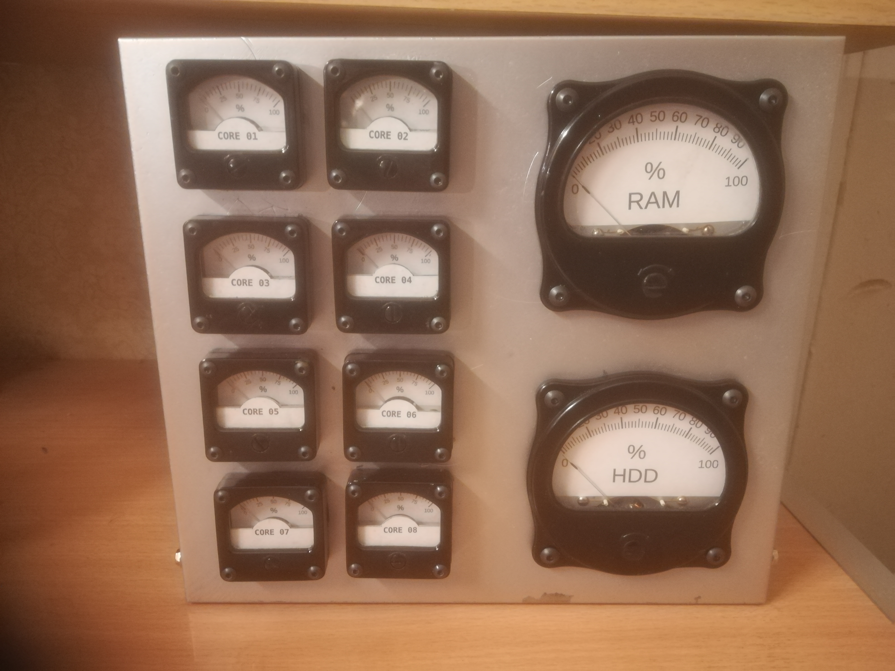
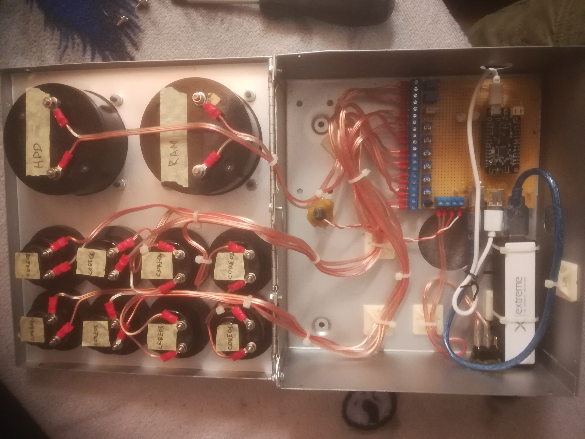
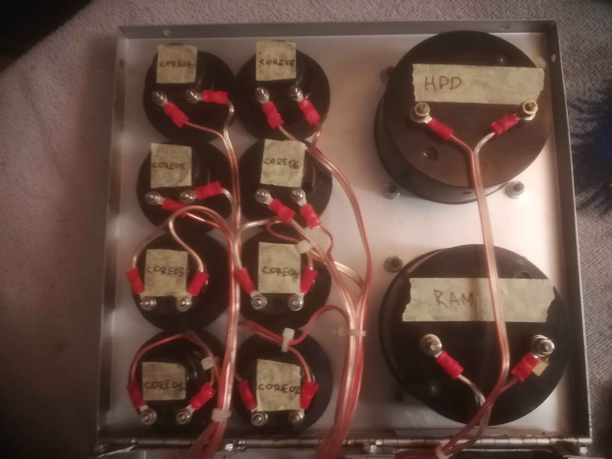
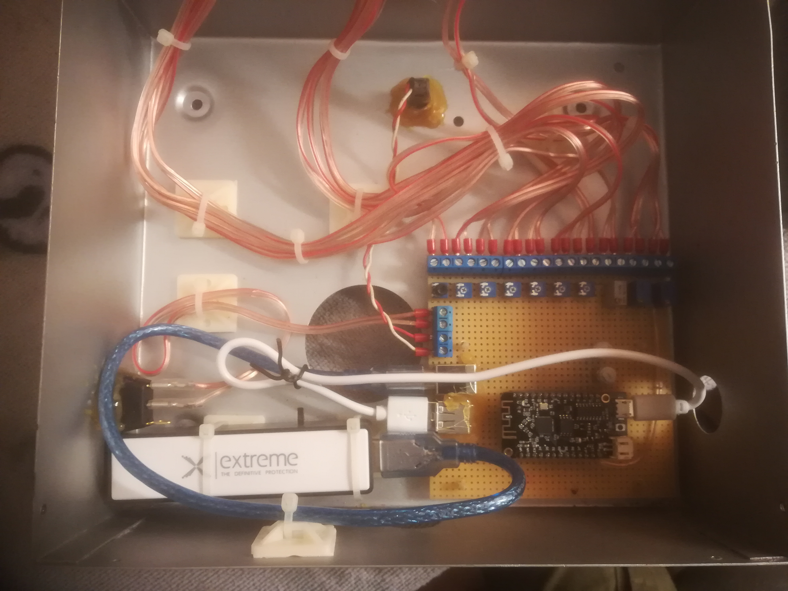
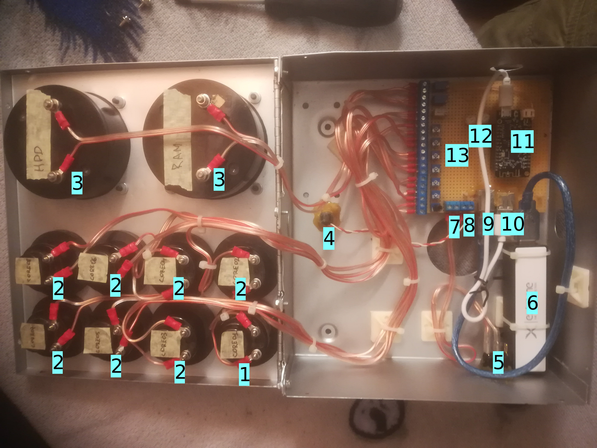
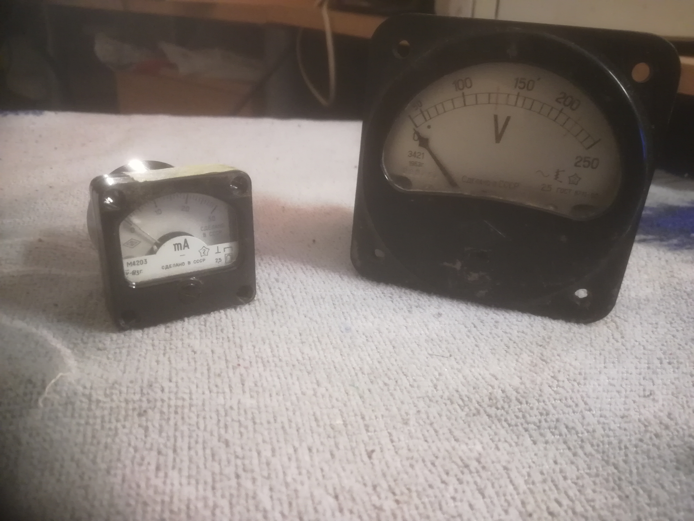
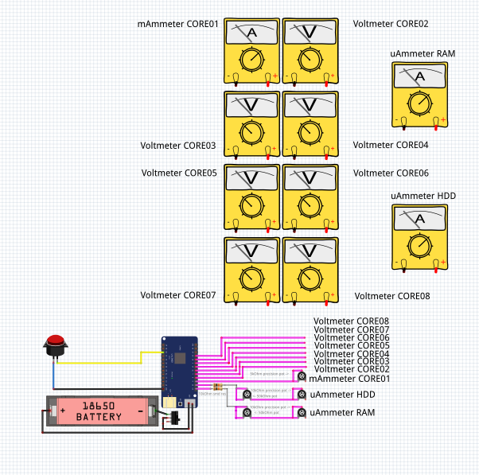
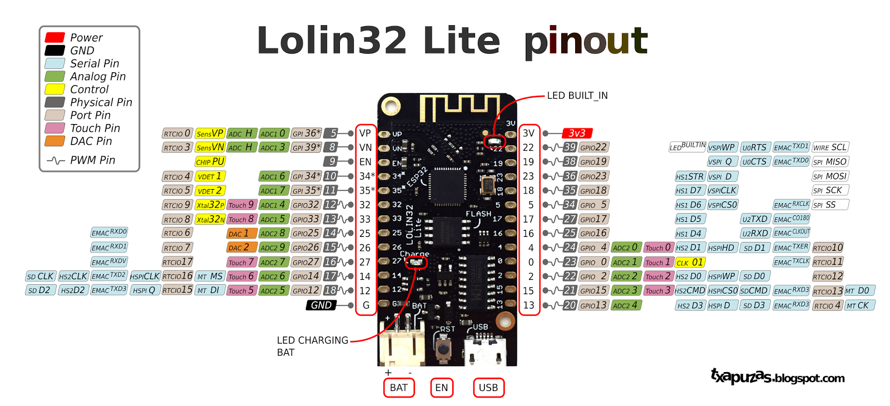

# Hardware-htop
Wireless desktop device for visualizing system status.

 <!-- .element height="50%" width="50%" -->

### Summary:

1. [Description](#description)
2. [Linux script setup](#linux-script-setup)
3. [Hardware module schematic](#hardware-module-schematic)
4. [Setting up IDE and flashing firmware](#setting-up-ide-and-flashing-firmware)
5. [Additional sources](#additional-sources)
6. [Starting up and calibration](#starting-up-and-calibration)
7. [Video demonstration](#video-demonstration)
8. [Purpose](#purpose)  

------------------------------------------------------------------------------------------------------------------
### Description:

This device shows load of Your CPU cores, used HDD space in percents and used RAM in percents. It's wireless.
It has it's own web server, where Your OS is sending collected data about itself in JSON format. The project 
works only on Linux systems, however could be adapted to other OS.

The project consists of two parts: **Linux script** and **ESP32 board** with panel meters:

**Linux script** is a script, written in bash - endless loop, that collects data about the system (cpu core load, 
ram and hdd space), builds http request in JSON format and sends it to ESP32 board.

**ESP32 board** is [board][board_wiki] [I've used _Lolin32 lite_ board], with connected to it panel meters. I used old soviet 
ammeters and voltmeters. All of them were connected via resistors to reduce current (for bigger ones I used 50uA 
panel meters, so I needed to use appropriate resistors, like ~60kOhm) and voltage (I used 3v voltmeters, so I needed 
only slightly reduce voltage - I used potentiometers for 250kOhms, connected as voltage dividers).

Device also has reset button, power switch and powerbank to make it fully wireless ;)

TODO: add additional wire for the powerbank to charge the device without opening an enclosure :)


[Back](#summary)

------------------------------------------------------------------------------------------------------------------
### Linux script setup:

To make possible to run script on Linux [we are talking about **system_status_report.sh**], it's necessary first to install 
some additional software:

```sudo apt install -y jq sar curl```

Then follow these steps:

- Make the script ```[system_status_report.sh]``` executable:
  - ```chmod a+x system_status_report.sh```

- Copy script to init.d folder:
  - ```sudo cp ./system_status_report.sh /etc/init.d/``` 

- Run command: ```crontab -e``` and add to the end of file the following line:
  - ```@reboot bash /etc/init.d/system_status_report.sh```
  
- Save and exit.  

Done! Now when Linux will start, it'll collect data about cpu, hdd and ram, build request and send it to hardware module. 

P.S. Possibly You will need to fix hardware module ip address. Check Your router settings (DHCP clients).

[Back](#summary)

------------------------------------------------------------------------------------------------------------------
### Hardware module schematic

Few photos:

 <!-- .element height="50%" width="50%" -->

 <!-- .element height="50%" width="50%" -->

 <!-- .element height="50%" width="50%" -->

Schematic with description:

 <!-- .element height="50%" width="50%" -->

1. 1ma panel meter (M4203) - shows core load.
2. 3v panel meter (M4203) - shows core load.
3. 50uA panel meter (M494) - show hdd used space (left) and ram usage (right).
4. Reset switch.
5. Power switch.
6. Powerbank (1 cell).
7. Reset button connector.
8. Power switch connector.
9. Power bank connector.
10. Lolin32 module power connector.
11. Lolin32 module.
12. Two 50kOhm potentiometers ( there are also 10kOhm smd resistors connected in series with them to Lolin board).
13. Two 10kOhm potentiometers for 50uA ammeters, one 5kOhm potentiometer for 1ma ammeter, seven 250kOhm potentiometers 
for 3v voltmeters.   

Panel meters used:

 <!-- .element height="50%" width="50%" -->

Gauges:

The gauges for all panel meters could be found in ```front_panel_images``` folder. When you will print them, set scale to 103%.
The gauges were drawn in [Scale Master][scale_master] and exported as PNG with 600 dpi quality.

Circuit diagram:

 <!-- .element height="50%" width="50%" -->

[Back](#summary)

------------------------------------------------------------------------------------------------------------------
### Setting up IDE and flashing firmware:


[Back](#summary)

------------------------------------------------------------------------------------------------------------------
### Additional sources:

- Lolin32 pinout



[Back](#summary)

------------------------------------------------------------------------------------------------------------------
### Starting up and calibration:


[Back](#summary)

------------------------------------------------------------------------------------------------------------------
### Video demonstration:

https://youtu.be/7kQVsOccEv4 

[Back](#summary)

------------------------------------------------------------------------------------------------------------------
### Purpose:


[Back](#summary)

------------------------------------------------------------------------------------------------------------------

  [board_wiki]: <https://wiki.wemos.cc/products:lolin32:lolin32_lite>
  [scale_master]: <https://soulmare.github.io/scale_master/#>